# 实习一
## 基于 Shapefile 点数据的 KMeans 聚类实现

本项目实现了对 **Shapefile 格式的纯点数据** 进行 **KMeans 聚类** 的功能。您可以通过修改主函数中的参数，轻松更换聚类数据的路径、设置聚类类别数量等。

### 🧭 功能说明

* **getCenterCoordinates(point_list, center_num)**
  初始化聚类中心点。若不希望弹出初始化的可视化窗口，请将该函数内的 `plt.show()` 注释或删除。

* **getPointsCoordinates(path)**
  读取指定路径下的 `.shp` 文件，获取点的坐标信息。
  若不希望弹出原始点数据的可视化窗口，请将该函数内的 `plt.show()` 注释或删除。

---

### 📦 依赖库安装

请确保已安装以下库：

```bash
pip install pyshp
pip install matplotlib
```

---

### 📁 示例数据

使用 `data/实验1/` 路径下的数据进行测试。由于实验数据未提供投影信息，请先使用 ArcGIS 定义投影（正常情况下若已有投影则无需此操作）：

* **投影选择：** 高斯-克吕格投影（三度带）
* **带号：** 39
* **中央经线：** 117°

---

### 📊 聚类效果展示

* 数据概览
  

* 聚类点选取（5类）
  

* 聚为三类的结果展示
  

* 聚为五类的结果展示
  

---

如需自定义聚类数量或输入数据，只需修改主函数中的参数即可，灵活便捷。


---

<div align="center">
  <span style="font-size: 2em;">🌸</span>
  <br>
  <b>如在学术/生产环境使用本项目，请注明引用</b>
  <br>
  <i>—— 数据如樱，聚散成诗 ——</i>
</div>

---

# 实习二
## K函数（Ripley’s K Function）与L函数分析工具

### K函数说明
K函数（Ripley’K Function）可用于研究不同模式下空间尺度的点分布规律，计算方法是：

$$
\hat{K}(r) = \frac{|A|}{n(n-1)} \sum_{i=1}^{n} \sum_{j \neq i} I(d_{ij} \leq r) 
$$

为更直观展示，常使用L函数：

$$
L(r) = \sqrt{\frac{K(r)}{\pi}} - r
$$

但是Arcgis实际使用的是

$$
L(r) = \sqrt{\frac{K(r)}{\pi}}
$$

本项目实现了以上三种函数的计算以及可视化制图。

---
### 函数说明

#### `KFunction`

* **作用**：完整的 K 函数计算，包括多种参数可以选择
* **使用提示**：
    * 可通过设置 `getPointsCoordinates` 中的 `is_plot=True` 来可视化研究点的分布，并判断是否为经纬度坐标（一般若使用地理坐标系横坐标落在 0-180 区间）。
    * `point_list`可通过 `getPointsCoordinates()` 获取

#### ⚠ 使用注意

> 请确保输入的研究点和研究区域（如果有）为 **投影坐标系**！项目不设自动检测机制，经纬度输入会导致计算错误！

#### `LFunction` 和 `ArcgisLFunction`

* **作用**：分别实现两种形式的 L 函数计算
* **要求**：传入已计算出的 K 函数值（请先运行 `KFunction`）

---

### 依赖库安装

请确保已安装以下库：

```bash
pip install pyshp matplotlib numpy tqdm shapely
```

### 特性

* 多种参数，多种模式的选择
* 快捷的可视化
* 进度条的显示，让等待不那么焦急

---

### 实施例：以武汉市银行为例

* 数据来源：使用高德 API 抓取，工具见：[POI 抓取工具](https://github.com/liujiao111/poi)
* 投影方式：使用 ArcGIS 将 WGS84 坐标系转换为 **CGCS2000 东经114投影坐标系**

#### 与Arcgis分析工具对比

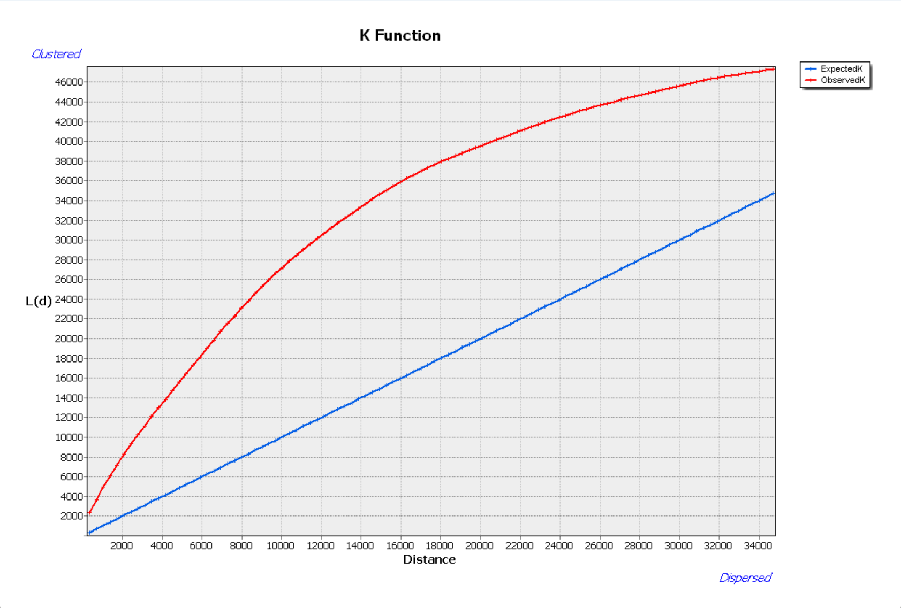
图1: Arcgis K函数计算结果</em></p>

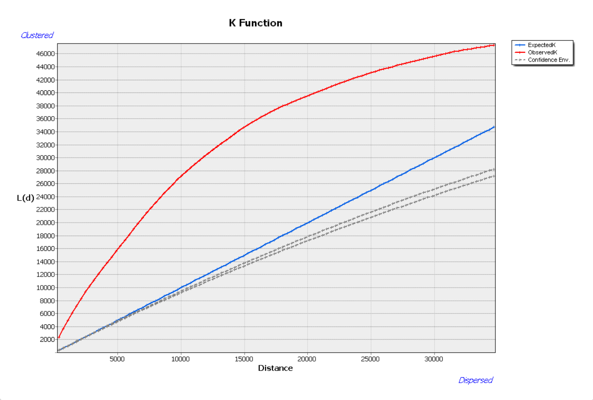
图2: Arcgis 置信区间分析</em></p>
    
 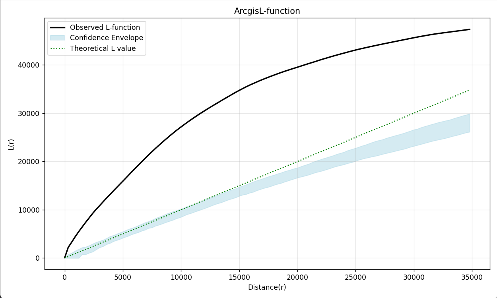
 图3: ArcgisLFunction计算结果

>结论1：和arcgis的结果无明显差异，公式的正确性以及代码实施的准确性。此外，设置Arcgis的步数为100，Arcgis不加缓冲区大约需要3分钟，加入缓冲区为5小时。代码运行时间为1分钟，说明程序运算时间上的优越性。

#### 不同步长的设置结果

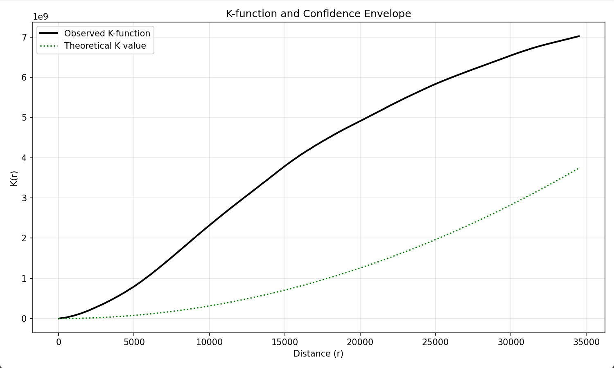
图4: 步长500m计算结果

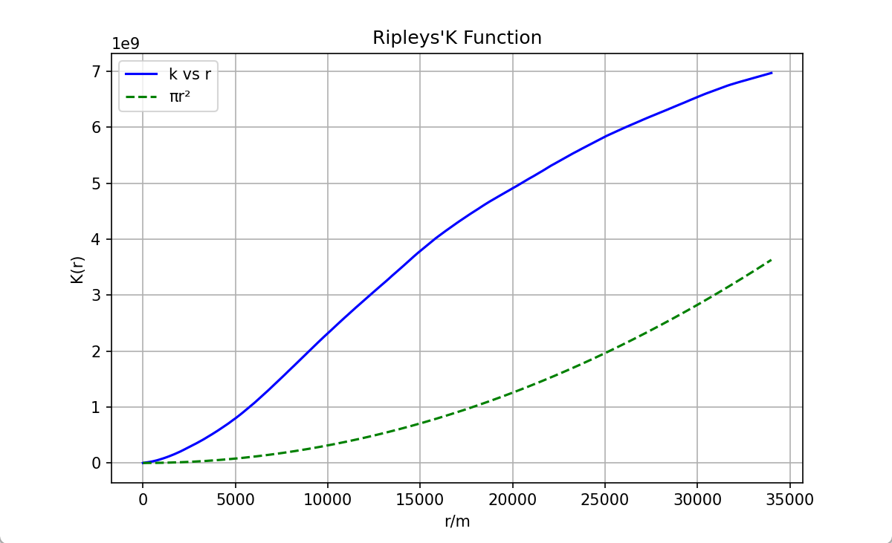
图5: 步长1m计算结果

>结论2：步长为500m的计算使用越1分钟，步长为1m的使用3小时，可以看出，步长会极大地影响代码的运行时间，但是从结果上来看这个函数对步长不是很敏感，因此可以一定程度地选择大步长

#### 边界效应的影响

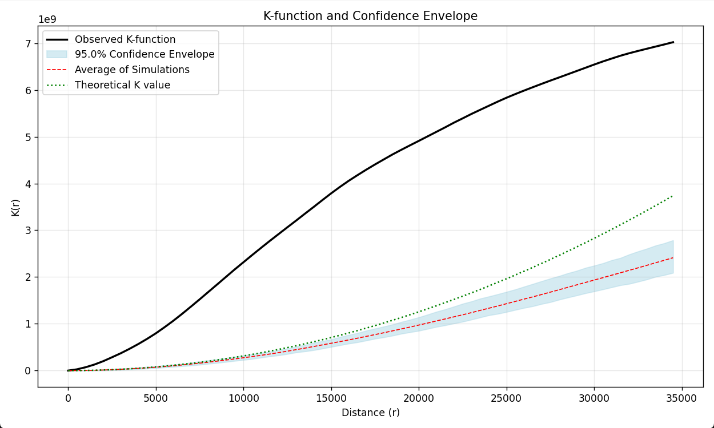
图6: 加入95%的置信度

>结论3：加上置信度功能，若加上理论值πr²的曲线可以发现，模拟出来的置信度还是比理论值略小的，这说明了没有边界纠正整体计算出来的值会较小


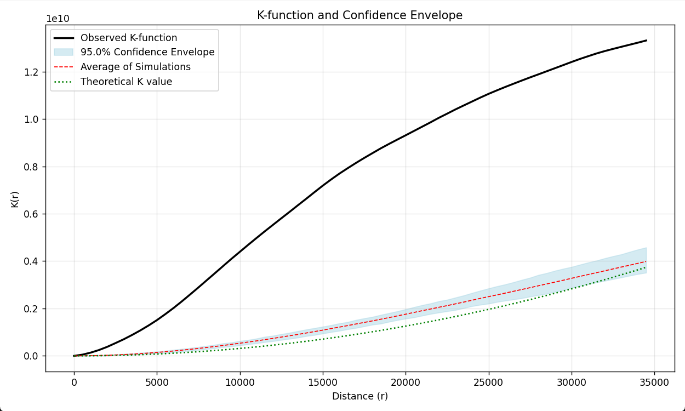
图7：使用外接矩形计算K函数值与置信度

>结论4：若不传入研究区域，程序功能也正常，能自动使用点的外接矩形就行计算，但该模式反而模拟值比理论值偏大（后续增加实验也发现有比其小的情况）,我的解释是理论值计算出来的是假想一个无限大平面上生成随机点，而我设置的函数随机点在为在矩形范围内，相当于所有随机点都在外接矩形外，而不是无限平面内

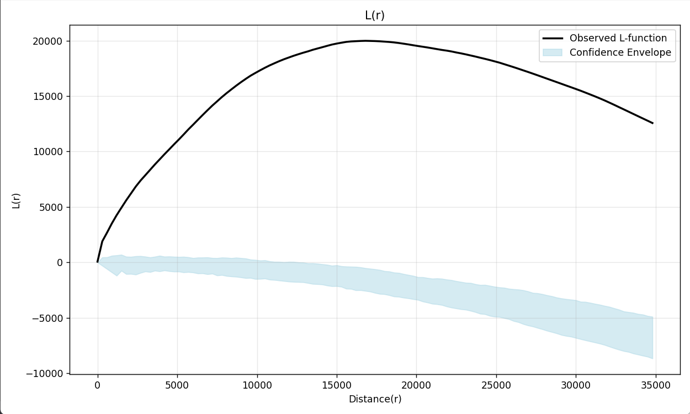
图8 L函数的计算结果
>结论5：从L函数小于0来看就可以看出为加边界借助功能会使得计算结果偏小，另外L函数总体大于0，说明在研究范围内，武汉银行的点分布模式为聚集模式，且在距离达到16000m的时候聚集程度最大

---

### 致谢
本项目直接依赖以下开源工具：

- **[PyShp](https://github.com/GeospatialPython/pyshp)** - Shapefile文件读写
- **[Shapely](https://shapely.readthedocs.io/)** - 空间几何计算（多边形面积/随机点生成）
- **[NumPy](https://numpy.org/)** - 距离矩阵和数值计算
- **[Matplotlib](https://matplotlib.org/)** - 结果可视化
- **[tqdm](https://github.com/tqdm/tqdm)** - 计算进度显示

特别感谢：
- **[高德地图API](https://lbs.amap.com/)** - 提供原始POI数据
- **[开源POI抓取工具](https://github.com/liujiao111/poi)** - 使用API获取POI 

---

<div align="center">
  <span style="font-size: 2em;">🌌</span>
  <br>
  <b>如引用本项目，您就是我们的同星者</b>
  <br>
  <i>—— 数据如星尘，算法似银河 ——</i>
</div>

---

# 实习三

## 基于局部莫兰指数（Anselin Local Moran'I）的聚类与异常值分析

### 局部莫兰指数计算
局部莫兰指数 $I_i$ 的计算公式为：

$$
I_i = \frac{(x_i - \bar{x})}{S^2} \cdot \left( \sum_{j=1,j \ne i}^{n} w_{ij}(x_j - \bar{x}) \right)
$$

其中：

$x_i$：目标单元 $i$ 的属性值。

$\bar{x}$：所有单元属性的均值。

$S^2$：属性值的方差变种计算公式（ $S^2 = \frac{\sum_{j=1,j \ne i}^{n}(x_j - \bar{x})^2}{n-1}$ ）。

$w_{ij}$：空间权重矩阵（如邻接矩阵、距离衰减权重等）。

$n$：总单元数。

---

### 权重计算矩阵

关于权重计算矩阵，本项目实现了三种权重计算矩阵，包括:

* **contiguityEdgesOnly(边邻接法)**:相当于Arcgis里的CONTIGUITY_EDGES_ONLY，与多边形邻接则权重置为1，否则为0，邻接的判定标准使用shapely的intersects方法，点接触，边接触，有重叠区域均算邻接

* **inverseDistance(距离倒数法)**:类似于Arcgis里的INVERSE_DISTANCE，距离计算的基于每个面元素的中心点距离，根据距离的倒数给定权重

* **fixedDistanceBand(固定距离法)**：相当于Arcgis里的FIXED_DISTANCE_BAND。在指定临界距离（距离范围或距离阈值）内的邻近要素将分配有值为 1 的权重，在指定临界距离外的邻近要素将分配值为0的权重。距离计算的基于每个面元素的中心点距离

---
### p值和z得分计算

p值和z得分的计算基于随机排列的模拟过程，具体来说，将所有的研究属性进行随机打乱，由此来模拟空间随机分布的零假设，然后计算莫兰指数，将模拟得到的莫兰指数$I_{sim}$和真实的莫兰指数$I$进行比较。


若 $I_i > 0$（正自相关）：

$$
  p_i = \frac{ \text{Number of } I_{sim,k} \geq I_i }{ m }
$$

若 $I_i < 0$（负自相关）：

$$
  p_i = \frac{ \text{Number of } I_{sim,k} \leq I_i }{ m }
$$

z 得分（标准化偏差）

$$
z_i = \frac{ I_{sim} - \mu_{sim} }{ \sigma_{sim} }
$$

其中：

$\mu_{sim} = \text{Mean}(\text{sim}_i)$ ，为模拟值的均值
$\sigma_{sim} = \text{Std}(\text{sim}_i)$ ，为模拟值的标准差，使用无偏估计


>虽然本项目想极力复原Arcgis的计算过程，但是经过测试p值和z得分的计算相比于Arcgis会更趋向于离散情况

---

### 聚类模式的判断

* 若p值不显著则标记为 “Not significant”；
* 若显著且 Local Moran's I 为正：
    * 自身值高于全局平均 → “HH”
    * 自身值低于全局平均 → “LL”
* 若显著且 Local Moran's I 为负：
    * 自身值高于邻居均值 → “HL”
    * 自身值低于邻居均值 → “LH”

>没找到Arcgis的计算方法，自创采用全局和局部平均值来计算


### 函数说明

#### `localMoran`

* **作用**：完整的局部莫兰指数聚类异常计算

* **使用示例**：
    ```python
    gdf=getPolygonFromShpFile("China.shp")
    gdf_background=getPolygonFromShpFile("China_line.shp")
    saved_shp_path="聚类异常.shp"     
    localMoran(
        gdf_polygon=gdf,                            # 研究的面
        study_attribute="受教育",                    # 研究的属性名
        mode="fixedDistanceBand",                   # 权重矩阵的计算模式"inverseDistance""contiguityEdgesOnly""fixedDistanceBand"
        distance_threshold=1000000,                 # 距离阈值
        is_std=True,                                # 是否对权重矩阵标准化
        W=None,                                     # 权重矩阵（不传入，函数内计算）
        p_threshold=0.05,                           # p阈值
        n_simulations=999,                          # 模拟的次数
        saved_shp_path=saved_shp_path,              # 分析结果shpfile保存地址，不需要该功能填None
        ignored_attributes=["NAME"],                # 有忽略值的属性
        ignored_values=[["香港","澳门","台湾"]] ,    # 具体的忽略值，一定要列表里套列表！
        gdf_background=gdf_background               # 背景元素，提供十段线等，没有就填None
        )
    ```

---

### 依赖库安装

请确保已安装以下库：

```bash
pip install geopandas numpy shapely pandas tqdm
```

### 特性

* 高度自定义的参数
* 多种模式可供选择
* 快捷的可视化
* 进度条的显示，让等待不那么焦急
* 提供忽略缺失值功能
* 让你从Arcgis里解放出来

---

### 实施例：2021年15岁及以上人口平均受教育年限（不含港澳台）的聚类与异常值分析

* 数据来源：国家统计局
* 投影方式：地图数据使用投影坐标系


#### 与Arcgis分析工具对比


图1 使用边邻接法计算出来的莫兰指数和Arcgis计算出来的对比

>结论一:从莫兰指数的结果值来看，在都选择边邻接法时，二者的计算结果比较接近，说明程序算法实施的准确性，但是又不完全相同，说明在具体的算法，例如边邻接的判断准则，面面直接的距离计算方法上，存在差异。但是编写程序的计算过程完全可见，具有自主可控的优越性

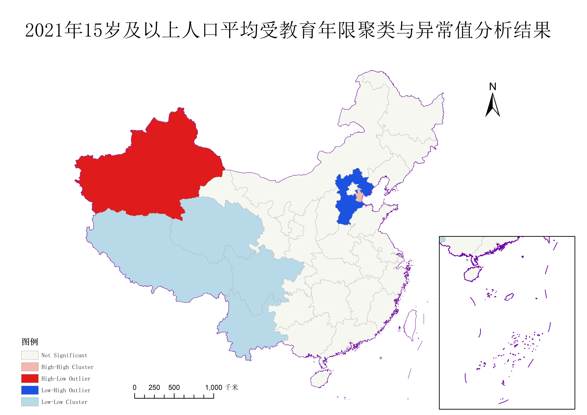
图2 arcgis邻接边法分析结果

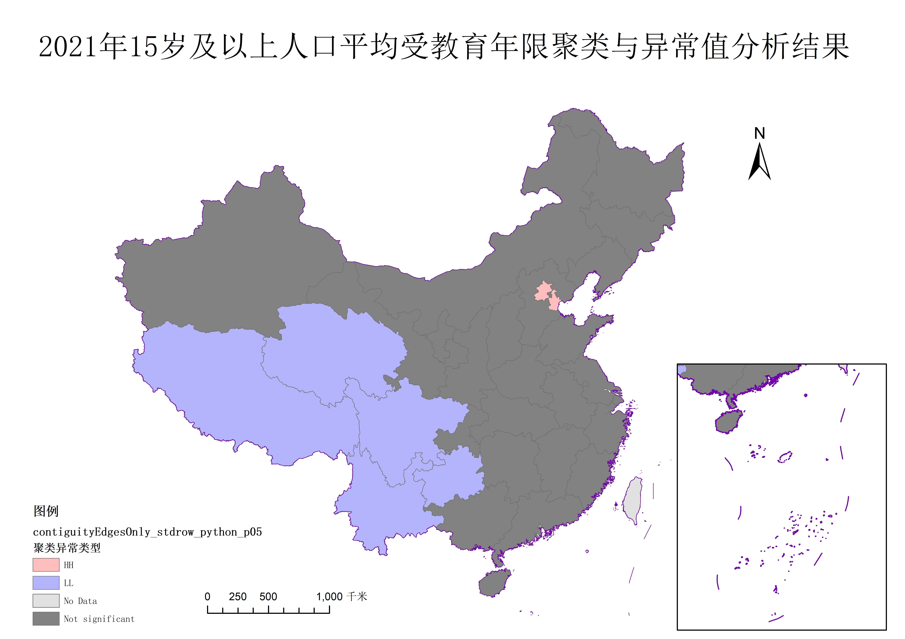
图3 python代码邻接边法分析结果

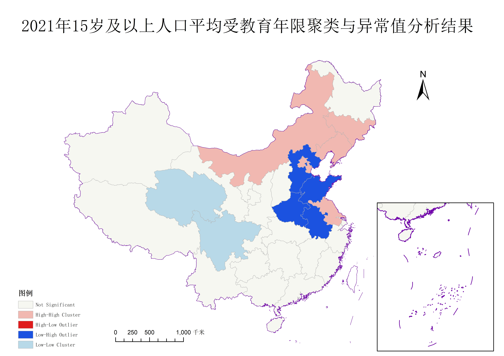
图4 arcgis固定距离法1000km分析结果

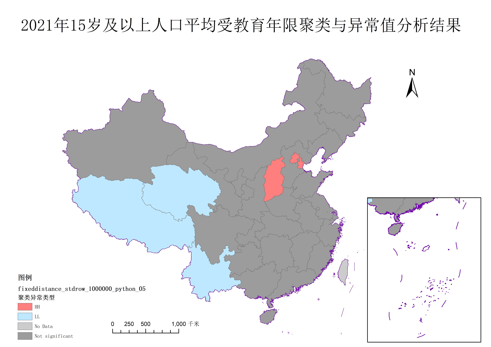
图5 python代码固定距离法1000km分析结果

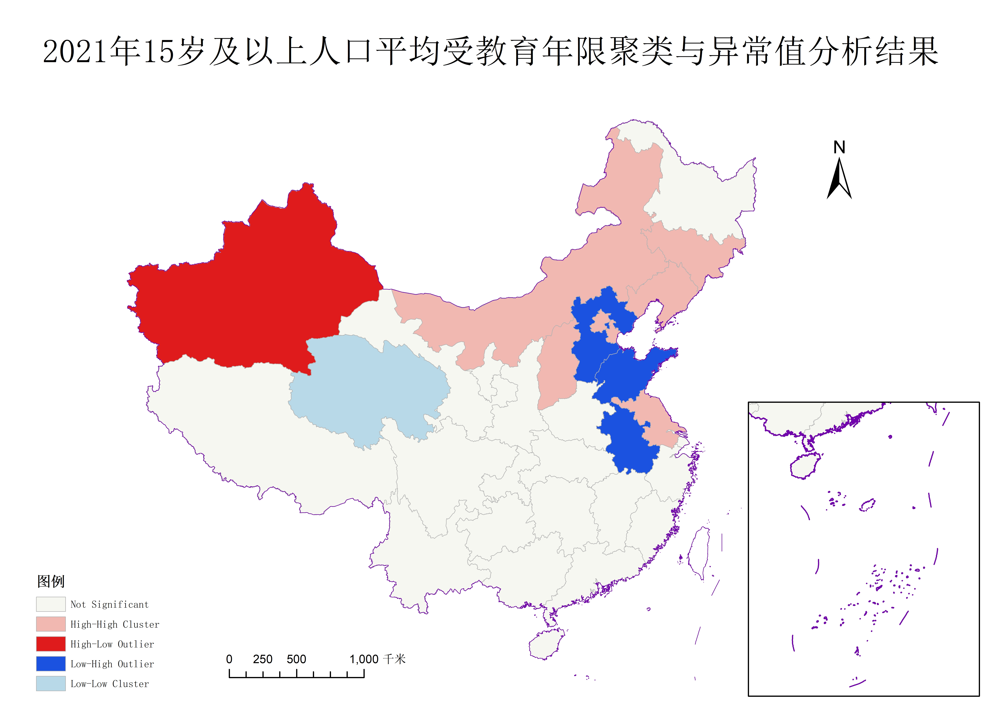
图6 arcgis距离倒数法分析结果

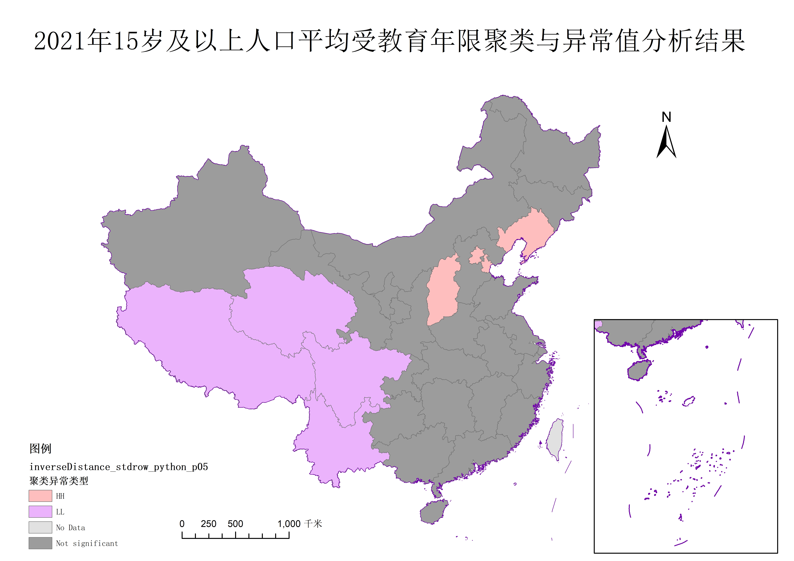
图7 python代码距离倒数法分析结果

>结论二：从工具的选择上来看，本项目编写的代码对HH和LL冷热点聚类较为为敏感，而Arcgis对HL和LH聚类异常更加敏感，这一差异主要是由p和z值的不同引起的，Arcgis计算的p和z值更倾向于拒绝零假设，当莫兰值为负值时表现更明显，所以HL、LH异常值更多

>结论三：从方法的选择来看，邻接边表法只考虑和多边形相接的多边形，所以分析类型会呈现一个更集中的状态，而距离倒数法和固定距离法在影响因素里加入距离，从而扩大影响范围，所以最终的分析结果呈现更加离散

#### p阈值对分类的影响

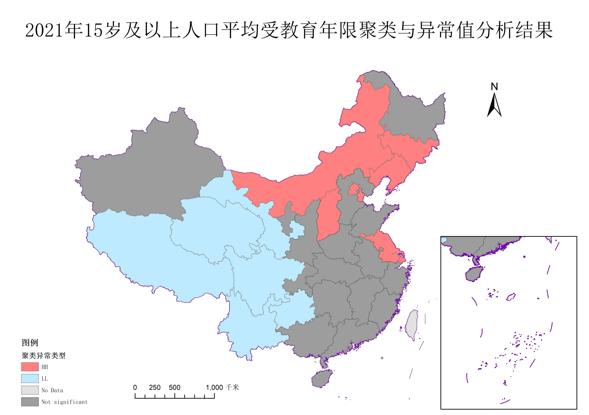
图8 距离倒数法p阈值0.1分析结果


图9 距离倒数法p阈值0.2分析结果

>结论四 本项目提供的莫兰指数计算方法中给出了对p阈值的设置，经典阈值是0.05。通过调整阈值，可以看到，阈值越大，异常或聚类结果变多，符合阈值越大说明假设越容易被拒绝，该面越容易被判别为非随机分布的理论。

>结论五 综合以上的所有实验，可以得出2025年15岁以上人口平均受教育年限（以下简称受教育年限）的分布结果，即我国西南地区的受教育年限呈现低值聚集，可以推测该地为教育弱势地区，而西北部的新疆呈现高值异常，可能与我国特殊政策有关，北京、天津、江苏、浙江、上海、辽宁、吉林等东部/东北沿海省市。说明这些地区的受教育年限较高，且与之相邻的地区也普遍教育水平较高，与我国的经济发展格局相吻合经济发展的空间不平衡格局相吻合。中部城市相对于来说呈现一个随机分布。

---

### 致谢

本项目直接依赖以下开源工具，感谢开发者与社区的贡献：

- **[GeoPandas](https://geopandas.org/)** – 地理空间数据处理与空间操作
- **[NumPy](https://numpy.org/)** – 数值计算与距离矩阵构建
- **[Shapely](https://shapely.readthedocs.io/)** – 几何对象分析与空间关系判断
- **[Pandas](https://pandas.pydata.org/)** – 数据清洗与结构化处理
- **[tqdm](https://github.com/tqdm/tqdm)** – 控制台进度条展示
