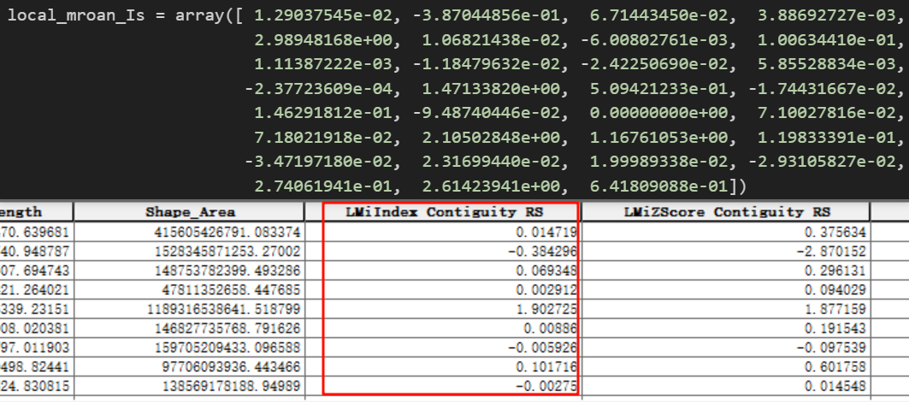

1. 计算公式
局部莫兰指数 $I_i$ 的计算公式为：

$
I_i = \frac{(x_i - \bar{x})}{S^2} \cdot \left( \sum_{j=1,j \ne i}^{n} w_{ij}(x_j - \bar{x}) \right)
$

其中：

$x_i$：目标单元 $i$ 的属性值。
$\bar{x}$：所有单元属性的均值。
$S^2$：属性值的方差,这玩意还不是方差？（$S^2 = \frac{\sum_{j=1,j \ne i}^{n}(x_j - \bar{x})^2}{n-1}$）。
$w_{ij}$：空间权重矩阵（如邻接矩阵、距离衰减权重等）。
$n$：总单元数。

本项目没有实现基于数学推导的p值和和z得分的计算，若有需要可以修改xxx函数
而是基于蒙特卡洛算法，将研究区的研究属性值随机打乱，得到p和z得分，其中：

若 $I_i > 0$（正自相关）：

$$
  p_i = \frac{ \text{Number of } I_{i,k} \geq I_i }{ m }
  $$

若 $I_i < 0$（负自相关）：

$$
  p_i = \frac{ \text{Number of } I_{i,k} \leq I_i }{ m }
  $$

z 得分（标准化偏差）
$$
z_i = \frac{ I_i - \mu_i }{ \sigma_i }
$$
其中：

$\mu_i = \text{Mean}(\text{sim}_i)$（模拟值的均值）
$\sigma_i = \text{Std}(\text{sim}_i)$（模拟值的标准差，通常使用 样本标准差，即分母 $m-1$）

## **1. 判别空间模式的规则**

说明算法的准确性，但是其它算法插件较大，说明算法选择的差异性

2. Python 代码实现判别逻辑
