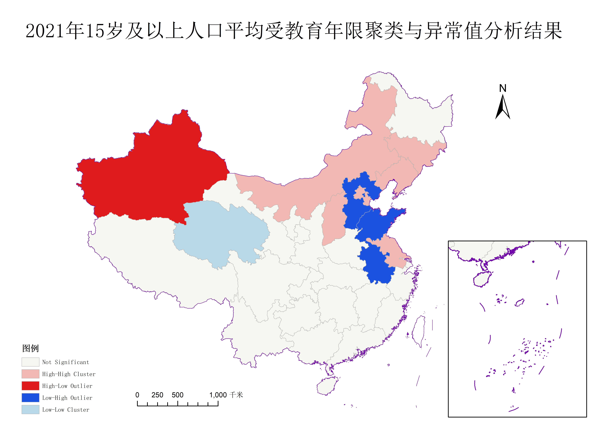
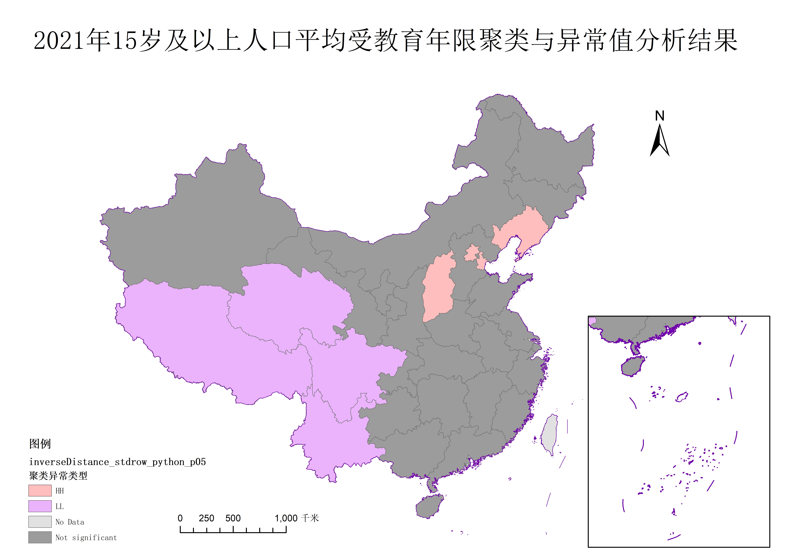
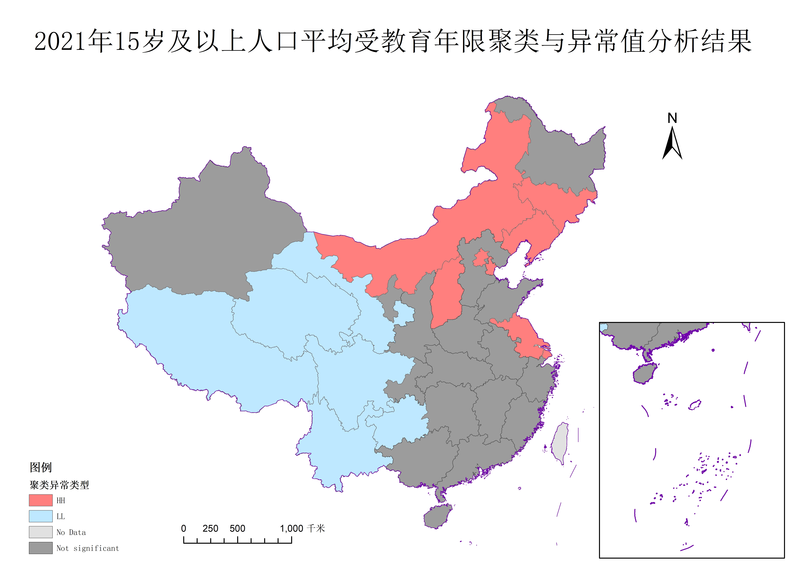
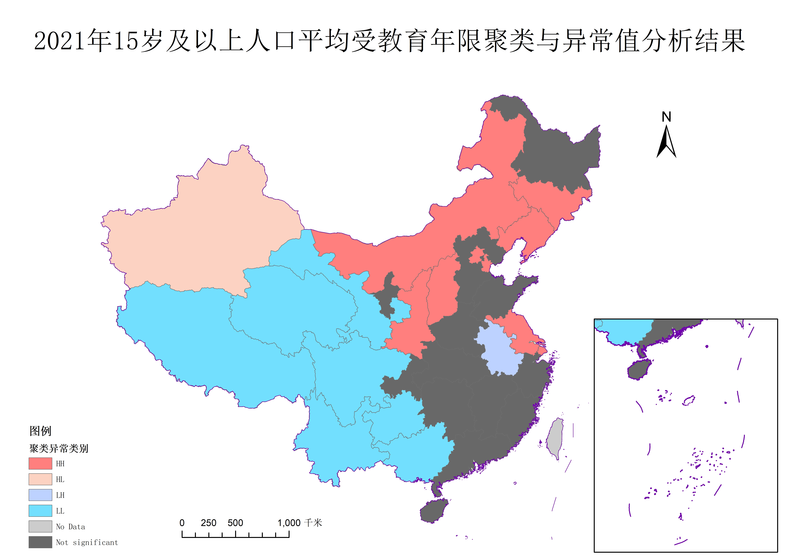

## 基于局部莫兰指数（Anselin Local Moran'I）的聚类与异常值分析

### 局部莫兰指数计算
局部莫兰指数 $I_i$ 的计算公式为：

$
I_i = \frac{(x_i - \bar{x})}{S^2} \cdot \left( \sum_{j=1,j \ne i}^{n} w_{ij}(x_j - \bar{x}) \right)
$

其中：

$x_i$：目标单元 $i$ 的属性值。
$\bar{x}$：所有单元属性的均值。
$S^2$：属性值的方差变种计算公式（$S^2 = \frac{\sum_{j=1,j \ne i}^{n}(x_j - \bar{x})^2}{n-1}$）。
$w_{ij}$：空间权重矩阵（如邻接矩阵、距离衰减权重等）。
$n$：总单元数。

---

### 权重计算矩阵

关于权重计算矩阵，本项目实现了三种权重计算矩阵，包括:

* **contiguityEdgesOnly(边邻接法)**:相当于Arcgis里的CONTIGUITY_EDGES_ONLY，与多边形邻接则权重置为1，否则为0，邻接的判定标准使用shapely的intersects方法，点接触，边接触，有重叠区域均算邻接

* **inverseDistance(距离倒数法)**:类似于Arcgis里的INVERSE_DISTANCE，距离计算的基于每个面元素的中心点距离，根据距离的倒数给定权重

* **fixedDistanceBand(固定距离法)**：相当于Arcgis里的FIXED_DISTANCE_BAND。在指定临界距离（距离范围或距离阈值）内的邻近要素将分配有值为 1 的权重，在指定临界距离外的邻近要素将分配值为0的权重。距离计算的基于每个面元素的中心点距离

---
### p值和z得分计算

p值和z得分的计算基于随机排列的模拟过程，具体来说，将所有的研究属性进行随机打乱，由此来模拟空间随机分布的零假设，然后计算莫兰指数，将模拟得到的莫兰指数$I_{sim}$和真实的莫兰指数$I$进行比较。


若 $I_i > 0$（正自相关）：

$$
  p_i = \frac{ \text{Number of } I_{sim,k} \geq I_i }{ m }
  $$

若 $I_i < 0$（负自相关）：

$$
  p_i = \frac{ \text{Number of } I_{sim,k} \leq I_i }{ m }
  $$

z 得分（标准化偏差）
$$
z_i = \frac{ I_{sim} - \mu_{sim} }{ \sigma_{sim} }
$$
其中：

$\mu_{sim} = \text{Mean}(\text{sim}_i)$（模拟值的均值）
$\sigma_{sim} = \text{Std}(\text{sim}_i)$（模拟值的标准差，使用无偏估计）


>虽然本项目想极力复原Arcgis的计算过程，但是经过测试p值和z得分的计算相比于Arcgis会更趋向于离散情况

---

### 聚类模式的判断

* 若p值不显著则标记为 “Not significant”；
* 若显著且 Local Moran's I 为正：
    * 自身值高于全局平均 → “HH”
    * 自身值低于全局平均 → “LL”
* 若显著且 Local Moran's I 为负：
    * 自身值高于邻居均值 → “HL”
    * 自身值低于邻居均值 → “LH”

>没找到Arcgis的计算方法，自创采用全局和局部平均值来计算


### 函数说明

#### `localMoran`

* **作用**：完整的局部莫兰指数聚类异常计算

* **使用示例**：
    ```python
    gdf=getPolygonFromShpFile("China.shp")
    gdf_background=getPolygonFromShpFile("China_line.shp")
    saved_shp_path="聚类异常.shp"     
    localMoran(
        gdf_polygon=gdf,                            # 研究的面
        study_attribute="受教育",                    # 研究的属性名
        mode="fixedDistanceBand",                   # 权重矩阵的计算模式"inverseDistance""contiguityEdgesOnly""fixedDistanceBand"
        distance_threshold=1000000,                 # 距离阈值
        is_std=True,                                # 是否对权重矩阵标准化
        W=None,                                     # 权重矩阵（不传入，函数内计算）
        p_threshold=0.05,                           # p阈值
        n_simulations=999,                          # 模拟的次数
        saved_shp_path=saved_shp_path,              # 分析结果shpfile保存地址，不需要该功能填None
        ignored_attributes=["NAME"],                # 有忽略值的属性
        ignored_values=[["香港","澳门","台湾"]] ,    # 具体的忽略值，一定要列表里套列表！
        gdf_background=gdf_background               # 背景元素，提供十段线等，没有就填None
        )
    ```

---

### 依赖库安装

请确保已安装以下库：

```bash
pip install geopandas numpy shapely pandas tqdm
```

### 特性

* 高度自定义的参数
* 多种模式可供选择
* 快捷的可视化
* 进度条的显示，让等待不那么焦急
* 提供忽略缺失值功能
* 让你从Arcgis里解放出来

---

### 实施例：2021年15岁及以上人口平均受教育年限（不含港澳台）的聚类与异常值分析

* 数据来源：国家统计局
* 投影方式：地图数据使用投影坐标系


#### 与Arcgis分析工具对比


图1 使用边邻接法计算出来的莫兰指数和Arcgis计算出来的对比

>结论一:从莫兰指数的结果值来看，在都选择边邻接法时，二者的计算结果比较接近，说明程序算法实施的准确性，但是又不完全相同，说明在具体的算法，例如边邻接的判断准则，面面直接的距离计算方法上，存在差异。但是编写程序的计算过程完全可见，具有自主可控的优越性


图2 arcgis邻接边法分析结果


图3 python代码邻接边法分析结果


图4 arcgis固定距离法1000km分析结果


图5 python代码固定距离法1000km分析结果


图6 arcgis距离倒数法分析结果


图7 python代码距离倒数法分析结果

>结论二：从工具的选择上来看，本项目编写的代码对HH和LL冷热点聚类较为为敏感，而Arcgis对HL和LH聚类异常更加敏感，这一差异主要是由p和z值的不同引起的，Arcgis计算的p和z值更倾向于拒绝零假设，当莫兰值为负值时表现更明显，所以HL、LH异常值更多

>结论三：从方法的选择来看，邻接边表法只考虑和多边形相接的多边形，所以分析类型会呈现一个更集中的状态，而距离倒数法和固定距离法在影响因素里加入距离，从而扩大影响范围，所以最终的分析结果呈现更加离散

#### p阈值对分类的影响


图8 距离倒数法p阈值0.1分析结果


图9 距离倒数法p阈值0.2分析结果

>结论四 本项目提供的莫兰指数计算方法中给出了对p阈值的设置，经典阈值是0.05。通过调整阈值，可以看到，阈值越大，异常或聚类结果变多，符合阈值越大说明假设越容易被拒绝，该面越容易被判别为非随机分布的理论。

>结论五 综合以上的所有实验，可以得出2025年15岁以上人口平均受教育年限（以下简称受教育年限）的分布结果，即我国西南地区的受教育年限呈现低值聚集，可以推测该地为教育弱势地区，而西北部的新疆呈现高值异常，可能与我国特殊政策有关，北京、天津、江苏、浙江、上海、辽宁、吉林等东部/东北沿海省市。说明这些地区的受教育年限较高，且与之相邻的地区也普遍教育水平较高，与我国的经济发展格局相吻合经济发展的空间不平衡格局相吻合。中部城市相对于来说呈现一个随机分布。

---

### 致谢

本项目直接依赖以下开源工具，感谢开发者与社区的贡献：

- **[GeoPandas](https://geopandas.org/)** – 地理空间数据处理与空间操作
- **[NumPy](https://numpy.org/)** – 数值计算与距离矩阵构建
- **[Shapely](https://shapely.readthedocs.io/)** – 几何对象分析与空间关系判断
- **[Pandas](https://pandas.pydata.org/)** – 数据清洗与结构化处理
- **[tqdm](https://github.com/tqdm/tqdm)** – 控制台进度条展示
