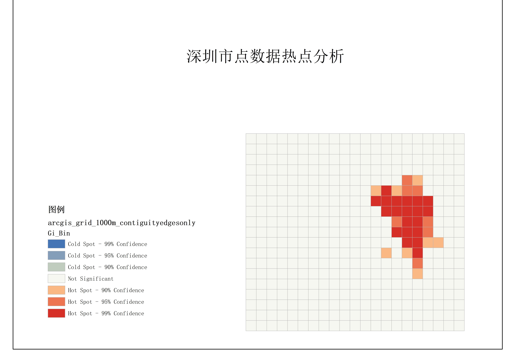

## 基于Getis-Ord Gi* 指数的热点分析

### 热点分析原理

#### 格网构建和点统计
`generateGridAndCountPoints` 函数完成该功能，支持两种方式定义格网尺寸：
* 设定格网数量（x_num 和 y_num），自动均分范围；
* 或指定格网单元尺寸（x_interval 和 y_interval）。

> 为保证所有的点都落在格网内且不在外边界上，会根据点的外接矩形加一个小padding，设置为1e-6

> 格网的点统计方法确保了每一个点仅落在一个格子里，且所有点都会落在某一个格子里，落在边界点上的处理方法为**左算右不算，下算上不算**

#### G系数计算原理
本项目的热点分析是基于G系数计算来进行的，系数的计算方法如下：

$$
G_i^* = \frac{\sum_{j=1}^n w_{i,j} x_j - \bar{X} \sum_{j=1}^n w_{i,j}}{S \sqrt{ \frac{n \sum_{j=1}^n w_{i,j}^2 - \left( \sum_{j=1}^n w_{i,j} \right)^2 }{n-1} }}
$$

其中：

$x_j$：要素 $j$ 的属性值。
$w_{i,j}$：要素 $i$ 和 $j$ 之间的 空间权重（再本计算中是否执行行标准化不影响结果）。
$n$：要素总数量。
$\bar{X} = \frac{1}{n} \sum_{j=1}^n x_j$：全局均值。

不标准的标准差 $S$ 的计算公式为：

$$
S = \sqrt{ \frac{ \sum_{j=1}^n x_j^2 }{n} - \bar{X}^2 }
$$

其中：

* $x_j$：为格网单元 $j$ 的属性值（如点的数量）；
* $n$：格网单元总数；
* $\bar{X} = \frac{1}{n} \sum_{j=1}^n x_j$：全局均值。


#### 权重计算矩阵

关于权重计算矩阵，仍然沿用本项目的上一小项目的计算方式，包括:

* **contiguityEdgesOnly(边邻接法)**:相当于Arcgis里的CONTIGUITY_EDGES_ONLY，与多边形邻接则权重置为1，否则为0，邻接的判定标准使用shapely的intersects方法，点接触，边接触，有重叠区域均算邻接

* **inverseDistance(距离倒数法)**:类似于Arcgis里的INVERSE_DISTANCE，距离计算的基于每个面元素的中心点距离，根据距离的倒数给定权重

* **fixedDistanceBand(固定距离法)**：相当于Arcgis里的FIXED_DISTANCE_BAND。在指定临界距离（距离范围或距离阈值）内的邻近要素将分配有值为 1 的权重，在指定临界距离外的邻近要素将分配值为0的权重。距离计算的基于每个面元素的中心点距离

深圳市的投影
深圳市越位于114E所以徐昂cgcs2000_114E

#### p值和z得分计算

计算出来的G系数即为z得分，然后查表计算p值

当然，以下是对公式中 **标准差 \$S\$ 的计算说明**，可直接补充进 README：

#### 格网模式的分类

当然，以下是用文字表述的 **Gi\*** 指数分类规则说明，适合写入 README 文档中：

---

### Gi\* 指数结果分类

在计算完成每个格网单元的 Getis-Ord Gi\* 指数（Z 分数）后，我们根据其统计显著性对区域进行分类，用以识别空间上的热点（高值聚集）与冷点（低值聚集）现象。

不同于之前的项目使用p进行归类，本次直接使用z得分（即G系数）进行分类，分类标准如下：

* 当 Gi\* 值显著为正，并且通过双侧显著性检验时，该区域被认定为 **热点（Hot Spot）**，即其属性值在空间上显著高于平均水平。

  * Gi\* 值 ≥ 2.58：为 99% 置信度的热点；
  * Gi\* 值 ≥ 1.96 且 < 2.58：为 95% 置信度的热点；
  * Gi\* 值 ≥ 1.65 且 < 1.96：为 90% 置信度的热点。

* 当 Gi\* 值显著为负，表示该区域为 **冷点（Cold Spot）**，即属性值显著低于周边区域：

  * Gi\* 值 ≤ -2.58：为 99% 置信度的冷点；
  * Gi\* 值 ≤ -1.96 且 > -2.58：为 95% 置信度的冷点；
  * Gi\* 值 ≤ -1.65 且 > -1.96：为 90% 置信度的冷点。

* 当 Gi\* 值在 -1.65 到 1.65 之间，表示该区域的属性值在统计上并无显著异常，属于 **不显著区（Not Significant）**。

---

### 函数说明


#### `GStarLocal`

* **作用**：基于 Getis-Ord Gi\* 指数的局部热点分析，用于识别空间上的热点和冷点。

* **使用示例**：

```python
grid = GStarLocal( 
    gdf_polygons=grid,                  # 要分析的面数据（如格网）
    study_attribute="num_pts",          # 研究的属性，使用本项目生成的格网时填写 "num_pts"
    mode="contiguityEdgesOnly",         # 空间权重矩阵的计算方式，可选："contiguityEdgesOnly" 或 "inverseDistance"
    distance_threshold=3000,            # 若选择 fixedDistanceBand 模式时需指定该值
    is_plot=True,                       # 是否绘制结果图
    saved_shp_path=None,                # 分析结果保存路径，若不需要保存则填 None
    is_std=False                        # 是否标准化权重矩阵，对 Gi* 结果无影响，保持默认即可
)
```

---

### 依赖库安装

请确保已安装以下库：

```bash
pip install geopandas shapely matplotlib tqdm numpy scipy pandas
```

---

### 特性

* 高度自定义的参数
* 多种模式可供选择
* 快捷的可视化
* 进度条的显示，让等待不那么焦急
* 直接从点里创建格网到热点分析一站式解决
* 让你从Arcgis里解放出来

---

### 实施例：深圳市点的热点分析

* 数据来源：实习四data文件夹里提供
* 投影方式：对应深圳市使用CSGS114E即EPSG:4547对应的是

#### 格网生成效果

图1：500米格网生成效果


图2：1000米格网生成效果


图3：3000米格网生成效果

> 结论1：格网生成正确，所有点均能落在格网里，点越密集格子的数值越大，说明点的数量统计正确。从地理分布来看，研究区域的东部点很密集，初步预计东部会产生热点。

#### 与Arcgis对比


图4: Arcgis500米格网边邻接法分析结果


图5: python代码计算500米格网边邻接法分析结果


图6: Arcgis1000米格网边邻接法分析结果


图7：python代码计算1000米格网边邻接法分析结果


图8：Arcgis3000米格网边邻接法分析结果


图9：python代码计算3000米分析结果

> 结论2：从工具的使用对比上来看，由两种工具生成的热点地图的热点分布范围大致相同，说明代码实施的正确性。但是又具有差异，说明在具体算法的选择上存在差异。具体而言，Arcgis对热点判断更加严格，所以最终呈现在热点面积范围，宜居置信程度上。

> 结论3：参数的对比上来看，格网的选择会造成尺度效应，若使用更小的格网，冷热点的区分更加细致，颗粒感更加重，反映局部特征，同时计算量会更大，另外小的格网可能会导致点的个数不足从而导致显著性不高。若使用更大网格，反映的是一个区域的情况，但可能掩盖小范围内的热点。

### 不同空间权重矩阵的选择


图10 python代码计算1000米格网固定距离带3000m分析结果


图11 python代码计算1000米格网距离倒数法分析结果

> 结论4：若选择固定距离带和距离倒数法，保保持格网大小为1000m不变，和上面的计算结果相比又两个变化，1.热点的范围明显扩大；2.出现了冷点。分析原因，这两种方法不再是只考虑邻居的属性值，还考虑了一定距离范围内的其它格网，当邻域增大后，空间的相关性增强

> 结论5：热点区域主要集中在图的右中部区域，说明该区域的数据值显著高于平均水平，呈强烈的正向空间聚集。位于图的左下角和右下角，同样形成了较为明显的连续区域。表明这些格网的数据值显著低于平均水平。中间及左右两侧还存在较多的不显著区域。


